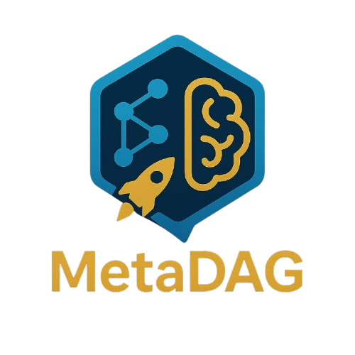

<div align="center">
  
</div>

# MetaDAG Chatbot

MetaDAG Chatbot is an AI-powered conversational interface designed to simplify and accelerate smart contract development on BlockDAG. It empowers users to generate, audit, and deploy smart contracts using natural language, backed by fast, scalable, and low-latency infrastructure.

---

## Project Overview

MetaDAG Chatbot transforms the way developers and non-developers interact with blockchain technology by providing:

- **Conversational AI Interface**: Use natural language to generate, audit, and deploy smart contracts without deep technical expertise.
- **Smart Contract Automation**: Seamlessly create, review, and launch contracts on BlockDAG through guided, AI-driven workflows.
- **Fast & Scalable Infrastructure**: Built for low-latency, high-throughput operations to support rapid development cycles.
- **Modern Full-Stack Architecture**: Next.js frontend, robust backend, and dual smart contract environments (Hardhat & Foundry).

---

## Purpose

The purpose of MetaDAG Chatbot is to democratize and accelerate smart contract development on BlockDAG. By leveraging AI and natural language processing, it enables anyone—from blockchain novices to experienced developers—to generate, audit, and deploy smart contracts efficiently and securely. This approach makes blockchain development more accessible, reduces barriers to entry, and fosters innovation in the decentralized ecosystem.

---

## App Architecture


---

## Project Structure

```
your-app/
├── contracts/
│   ├── hardhat/         # Hardhat contracts, scripts, tests
│   └── foundry/         # Foundry contracts, scripts, tests
└── frontend/            # Next.js frontend app
```

---

## Installation

### 1. Clone the repository

```bash
git clone <your-repo-url>
cd <your-app>
```

### 2. Set up the Frontend

```bash
cd frontend
cp .env.example .env.local  # Create your environment file
# Edit .env.local with your WalletConnect Project ID
yarn install
```

### 3. Set up Foundry (Smart Contracts)

```bash
cd ../contracts/foundry
cp .env.example .env  # Create your environment file
# Edit .env with your private key and RPC URL
forge build
```

### 4. Set up Hardhat (Smart Contracts)

```bash
cd ../hardhat
yarn install
npx hardhat compile
```

---

## Usage

### Frontend Development

```bash
cd frontend
yarn dev
```

### Smart Contract Development

#### Using Hardhat

```bash
cd contracts/hardhat
npx hardhat compile
npx hardhat test
npx hardhat run scripts/deploy.ts --network primordial
```

#### Using Foundry

```bash
cd contracts/foundry
forge build
forge test
forge script script/Deployer.s.sol --rpc-url $RPC_URL --broadcast --legacy --private-key $PRIVATE_KEY
```

---

## Environment Variables

- **Frontend (.env.local):**
  - `NEXT_PUBLIC_WALLET_CONNECT_PROJECT_ID=your_wallet_connect_project_id`
  - `OPENAI_API_KEY=your_openai_api_key_here`
  - Get your WalletConnect Project ID at https://cloud.walletconnect.com/
  - Get your OpenAI API key at https://platform.openai.com/api-keys

- **Smart Contracts (.env):**
  - `PRIVATE_KEY=your_private_key_here`
  - `RPC_URL=your_rpc_url_here`

---

## License

This project is licensed under the [Apache License 2.0](LICENSE).

---

## Developed by

Amritesh, Aniket, Navneet, Rithika, and Ujjawal
